# Galaxia
Explore, collect, and build as you traverse outer space.

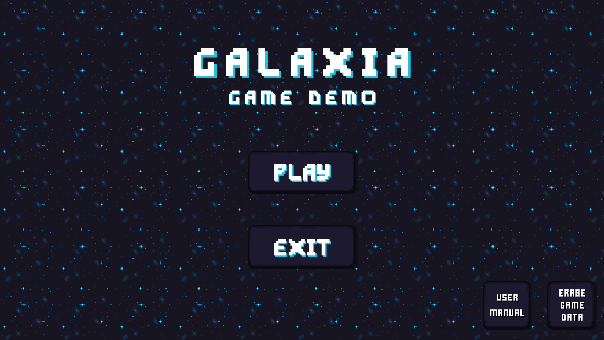

 
### Special Acknowledgements
Background music written and produced by [nwam](https://github.com/nwam) and friends.

## Features 
### Build and go on quests!
Talk to your Alien neighbours and they may give you quests! Build up a civilization on a new planet!

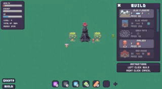

### Shop and organize your inventory!
An inventory that you can organize by drag and dropping. Talk to NPCs and they may sell you potions to heal you!

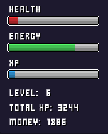
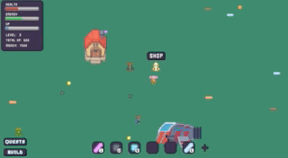
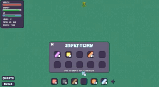

### Travel!
Build a spaceship to travel! Go to a variety of 3 planets. Watch out for enemies!

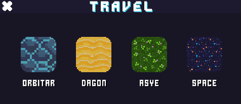
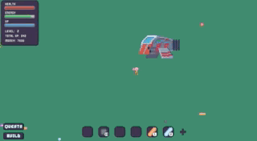
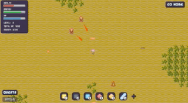
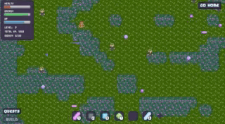

#### Protect yourself by attacking:
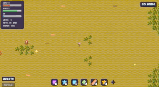

## Go to space and collect stars!
At the end of each level, collect an item that will make Bob prettier! 

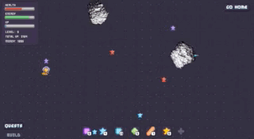

